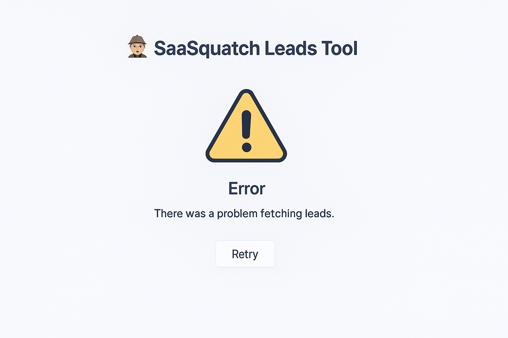

# 🦥 SaaSquatch Leads

SaaSquatch Leads is a mock lead generation and filtering dashboard built using Flask for the backend and Vite + React + TypeScript for the frontend. It allows users to browse, filter, and explore tech company leads based on their tech stacks, location, and more.

> This tool was built as part of an internship challenge. The focus was on full-stack architecture, smart filtering logic, and a polished UI/UX.

---

## 🚀 Features

- 🔍 Tech stack & keyword-based filtering
- 📍 Location filters
- 📥 Export filtered leads as CSV
- 💸 Mock credit tracking system
- 🛠️ Built-in error & loading states
- ✨ Responsive & clean design using Chakra UI

---

## 🧠 Tech Stack

**Frontend**  
- React + TypeScript  
- Vite  
- Chakra UI  
- Axios  

**Backend**  
- Flask  
- Python  
- JSON-based mock data

---

## 🛠️ Project Structure

```text
Caprae-Capital_SaaSquatchLeads/
│
├── backend/                    # Flask backend
│   ├── app.py
│   ├── filter_logic.py
│   └── data/
│       └── mock_leads.json
│
├── frontend/                   # Vite + React frontend
│   ├── src/
│   │   ├── components/
│   │   │   ├── LeadCard.tsx
│   │   │   ├── FilterBar.tsx
│   │   │   └── ...
│   │   ├── types.d.ts
│   │   └── main.tsx
│   └── public/
│
├── report.md                   # Submission report
├── requirements.txt            # Flask dependencies
└── README.md                   # You're reading it 😉
```
---
## ⚙️ Getting Started

### 📦 Backend Setup (Flask)

1. Navigate to the `backend` directory:
   ```bash
   cd backend
2. (Optional) Create a virtual environment:
   ```bash
   python -m venv venv
   source venv/bin/activate  # On Windows: venv\Scripts\activate
3. Install dependencies:
   ```bash
   pip install -r requirements.txt
4. Run the Flask server:
   ```bash
   python app.py
  The backend runs on http://localhost:5000.

### 🎨 Frontend Setup (React + Vite)

1.Navigate to the `frontend` directory:
   ```bash
   cd frontend
```
2. Install dependencies:
   ```bash
   npm install
3. Start the development server:
   ```bash
   npm run dev
  The frontend runs on http://localhost:5173.

---

## 🧪 Sample API Request (Optional)
  ```bash
  curl -X POST http://localhost:5000/filter_leads \
       -H "Content-Type: application/json" \
       -d '{"keywords": "Python", "location": "San Francisco"}'
  ```
---
## 📸 UI Screenshots

| Final Output | Error Handling |
|:------------:|:--------------:|
|  |  |

These screenshots illustrate the evolution of the interface—from the base mockup to the enhanced version with filtering, polished design, and graceful error management.
---
## 📋 Credits
```text
Developed by Malavika Gupta
Caprae Capital Internship Challenge · June 2025
